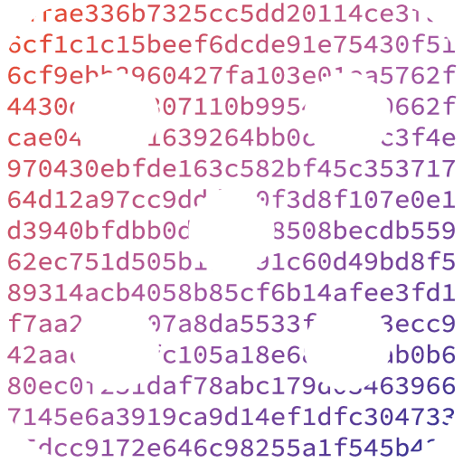
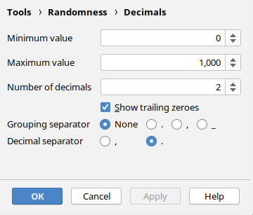
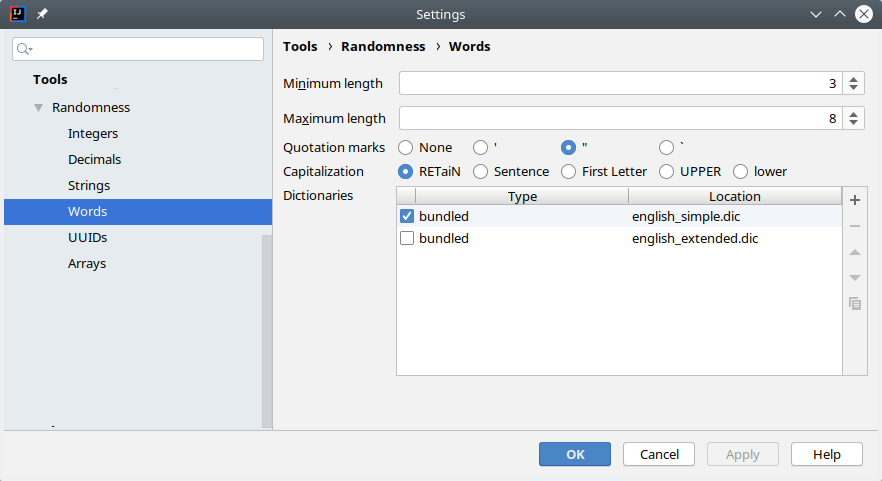

<h1 align="center">

<br/>
Randomness
</h1>

<p align="center">
    <a href="https://plugins.jetbrains.com/plugin/9836-randomness"></a>
    <a href="https://fwdekker.github.io/intellij-randomness/"></a>
    <br />
    <a href="https://travis-ci.org/FWDekker/intellij-randomness"></a>
    <a href="https://codecov.io/gh/FWDekker/intellij-randomness"></a>
</p>

Rather than going to [random.org](https://www.random.org/) or making up your own random data, you can now insert random data using an IntelliJ action!

This plugin is also available on the [plugin repository](https://plugins.jetbrains.com/plugin/9836-randomness).


## How to use


To insert random data, press <kbd>Alt + R</kbd> (or <kbd>⌥R</kbd>) and choose the type of data you want to insert. Hold <kbd>Shift</kbd> while selecting a data type to insert a whole array of values, or hold <kbd>Ctrl</kbd> (or <kbd>⌥</kbd>) while selecting to change the settings of that data type.


## Features
### Data types
There are five types of data that can be inserted:
1. **Integers**, such as `7,826,922`
2. **Decimals**, such as `8,816,573.10`
3. **Strings**, such as `"PaQDQqSBEH"`
4. **Words**, such as `"Imporous"`
5. **UUIDs**, such as `0caa7b28-fe58-4ba6-a25a-9e5beaaf8f4b`

In addition to these data types, it's also possible to generate entire **arrays** of a data type. For example, an array of integers might look like `[978, 881, 118, 286, 288]`.

### Settings
The way the data is generated can be adjusted to your demands. For example, you can select the smallest integer to generate, the quotation marks to surround strings with, the number of elements to put in an array, or the decimal separator to use for decimals.

### Dictionaries
Randomness is bundled with a small English dictionary from which it chooses random words. However, you may want to add words from another language or add a small selection of relevant words. Therefore, you can register your own dictionary files with the word generator and select which dictionaries it should pick words from. You can make your own dictionary file by creating a text file and putting one word on each line, and saving the file with the `.dic` extension. Lines that start with a `#` are ignored.

<p align="center"></p>


## Build instructions
This section contains instructions in case you want to build the plugin from source code.

```bash
gradlew runIde              # Open a sandbox IntelliJ instance running the plugin
gradlew buildPlugin         # Build an installable zip of the plugin
gradlew check               # Run tests and static analysis
gradlew codeCoverageReport  # Run tests and calculate coverage
gradlew dokka               # Generate documentation
```


## Credits
Thanks to [Georgios Andreadis](https://github.com/gandreadis) for the logo!
