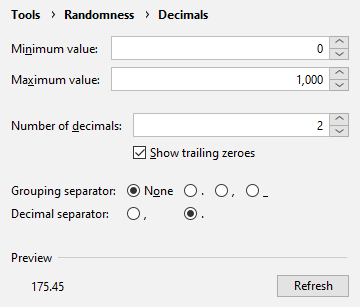
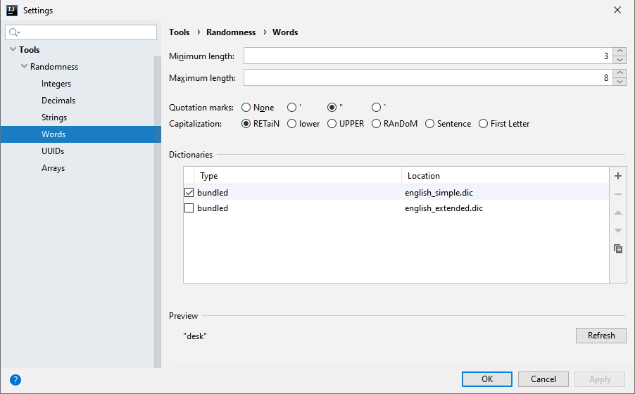

<h1 align="center">
    
    <br />
    Randomness
</h1>

<p align="center">
    <a href="https://plugins.jetbrains.com/plugin/9836-randomness"></a>
    <a href="https://fwdekker.github.io/intellij-randomness/"></a>
    <br />
    <a href="https://travis-ci.com/FWDekker/intellij-randomness"></a>
    <a href="https://codecov.io/gh/FWDekker/intellij-randomness"></a>
</p>

Rather than going to [random.org](https://www.random.org/) or making up your own random data, you can now insert random
numbers, strings, and UUIDs using an IntelliJ action!

This plugin is also available on the [plugin repository](https://plugins.jetbrains.com/plugin/9836-randomness).


## How to use


To insert random data, press <kbd>Alt + R</kbd> (<kbd>⌥R</kbd>) and choose the type of data you want to insert.
A different value will be inserted at each caret.

You can modify this by holding a key while selecting the type of data to insert:
* Hold <kbd>Shift</kbd> to insert a whole array of values.
* Hold <kbd>Ctrl</kbd> to open the settings of that data type.
* Hold <kbd>Alt</kbd> (<kbd>⌥</kbd>) to insert the same value at each caret.

Randomness can also be found in the main menu under <kbd>Tools</kbd> or in the
[<kbd>Generate</kbd> menu](https://www.jetbrains.com/help/idea/generating-code.html).

## Features
* **Data Types**<br />
  There are five types of data that can be inserted:
  1. **Integers**, such as `7,826,922`, in any base from binary to hexatrigesimal.
  2. **Decimals**, such as `8,816,573.10`, using customisable separators.
  3. **Strings**, such as `"PaQDQqSBEH"`, with custom symbol lists.
  4. **Words**, such as `"Imporous"`, with custom word lists.
  5. **UUIDs**, such as `0caa7b28-fe58-4ba6-a25a-9e5beaaf8f4b`, with or without dashes.

  In addition to these data types, it's also possible to generate entire **arrays** of a data type.
  For example, an array of integers might look like `[978, 881, 118, 286, 288]`.
* **Settings**<br />
  The way the data is generated can be adjusted to your demands.
  You can customise the smallest integer to generate, the quotation marks to surround strings with, the number of
  elements to put in an array, the decimal separator to use, the capitalisation of strings and UUIDs, and much more.
* **Previews**<br />
  To help you decide what settings to choose, a preview of the data that is generated with your current settings is
  shown at the bottom of the settings window.
* **Shortcuts**<br />
  Instead of using up all your shortcuts, Randomness only uses the <kbd>Alt + R</kbd> (or <kbd>⌥R</kbd>) shortcut by
  default.
  However, you have the option to assign a unique shortcut to each individual data type and each settings window to
  streamline your workflow.
* **Symbol sets**<br />
  While Randomness comes with a varied selection of symbols to use for generating strings, it also gives you the option
  to add your own symbols, with support for Chinese and mathematical symbols.
* **Dictionaries**<br />
  Randomness is bundled with a small English dictionary from which it chooses random words.
  However, you may want to add random words from another language or insert random movie quotes.
  You can create your own dictionaries by creating a text file and putting one option on each line, and saving the file
  with the `.dic` extension.
  Empty lines and lines that start with a `#` are ignored.

  <p align="center"></p>


## Development
This section contains instructions in case you want to build the plugin from source or want to help with development.

### Build/run
```bash
$ gradlew runIde       # Open a sandbox IntelliJ instance running the plugin
$ gradlew buildPlugin  # Build an installable zip of the plugin
```

### Quality assurance
```bash
$ gradlew test                # Run tests
$ gradlew test --tests X      # Run tests in class X
$ gradlew check               # Run tests and static analysis
$ gradlew codeCoverageReport  # Run tests and calculate coverage
```

### Miscellaneous
```bash
$ gradlew dokka  # Generate documentation
```


## Credits
Thanks to [Georgios Andreadis](https://github.com/gandreadis) for the logo!
