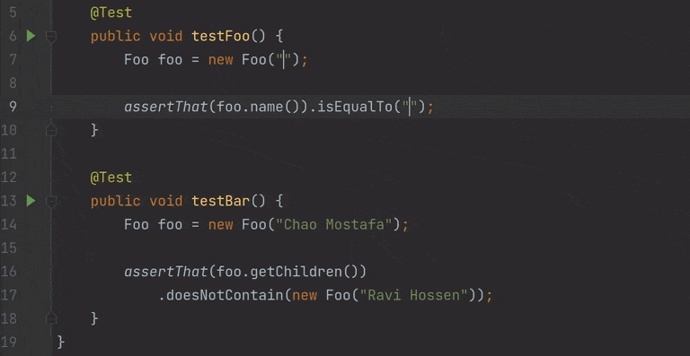
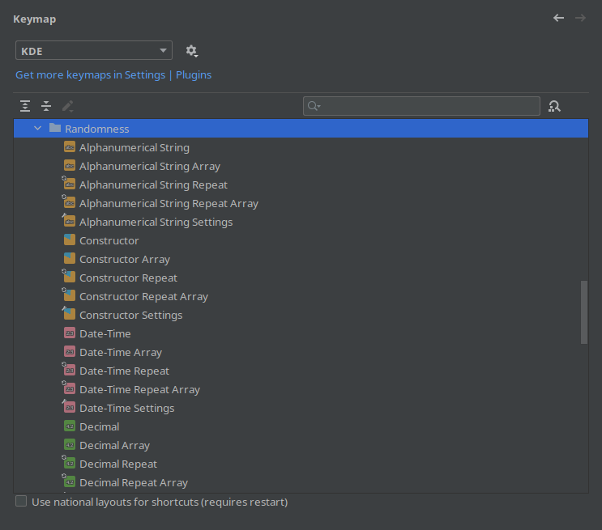

<h1 align="center">
    
    <br />
    Randomness
</h1>

<p align="center">
    <a href="https://plugins.jetbrains.com/plugin/9836-randomness"></a>
    <a href="https://plugins.jetbrains.com/plugin/9836-randomness/reviews"></a>
    <a href="https://plugins.jetbrains.com/plugin/9836-randomness"></a>
    <br />
    <a href="https://github.com/FWDekker/intellij-randomness/actions/workflows/ci.yml?query=branch%3Amain"></a>
    <a href="https://app.codecov.io/gh/FWDekker/intellij-randomness"></a>
    <a href="https://fwdekker.github.io/intellij-randomness/"></a>
</p>

# This README is about the upcoming v3 release. For information about the latest public version, [check the old README](https://github.com/FWDekker/intellij-randomness/tree/v2)

Rather than going to [random.org](https://www.random.org/) or making up your own random data, you can now insert random
numbers, UUIDs, names, IP addresses, and much more using an IntelliJ action!

This plugin is also available on the [plugin repository](https://plugins.jetbrains.com/plugin/9836-randomness)!


## 📖 How to use
To insert random data, press <kbd>Alt + R</kbd> (<kbd>or ⌥R</kbd>) to open the list of available templates and choose
one that suits your task.
By default, a different value is inserted at each caret.

You can modify this behavior by holding a key while selecting the type of data to insert:
* **Array**: Hold <kbd>Shift</kbd> to insert a customisable array of values.
* **Repeat**: Hold <kbd>Alt</kbd> (or <kbd>⌥</kbd>) to insert the same value at each caret.
* **Settings**: Hold <kbd>Ctrl</kbd> to open the settings of that data type.

You can hold multiple modifier keys to combine their effects.

Randomness can also be found in the main menu under <kbd>Tools</kbd> or in <kbd>Code > Generate</kbd>.



## ✨ Features
* 🕸 **Data Types**<br />
  There are six basic data types that can be inserted and customised:
    1. **Integers**, such as `7,826,922`, from a custom range, in any base from binary to hexatrigesimal.
    2. **Decimals**, such as `8,816,573.10`, using customisable separators.
    3. **Strings**, such as `"PaQDQqSBEH"`, specified using a regex.
    4. **Words**, such as `"Bridge"`, with predefined or custom word lists.
    5. **UUIDs**, such as `0caa7b28-fe58-4ba6-a25a-9e5beaaf8f4b`, with or without dashes.
    6. **Date-times**, such as `2022-02-03 19:03`, or any other format you want.
* 🧬 **Templates**<br />
  For complex kinds of data, you can use templates.
  A template is a list of data types that should be concatenated to create random data.
  Insert **phone numbers**, **email addresses**, **URLs**, **IP addresses**, or any **custom data type** you can think
  of.
  Of course, Randomness comes bundled with a whole array of predefined templates to help you out.
  If needed, you can reuse a template by including it in another template using a **reference**.

  
* 🗃️ **Arrays**<br />
  Need a lot of data?
  Insert **an entire array** of any template you want.
  For example, an array of integers might look like `[978, 881, 118, 286, 288]`.
  You can customise the brackets, delimiter, and number of elements to your liking every time you insert an array,
  because no two arrays are the same.

  
* ⌨️ **Shortcuts**<br />
  Instead of using up all your shortcuts, Randomness only uses the <kbd>Alt + R</kbd> (or <kbd>⌥R</kbd>) shortcut by
  default.
  However, to **streamline your workflow**, you can assign shortcuts to any template under your IDE's <kbd>Keymap</kbd>
  settings.

  
* 💨 **Fast insertion**<br />
  The insertion popup (shown when you press <kbd>Alt + R</kbd> (or <kbd>⌥R</kbd>) by default) is **searchable**:
  Just type something in the popup and relevant templates will be filtered out.
  Or use the **hotkeys** that are assigned to the first 10 templates in the list:
  Press any digit to directly insert the corresponding template.
  **Reorder templates** in the settings menu to change which template uses which hotkey.

  
* 👀 **Previews**<br />
  To **help you decide** what settings to choose, a preview of the template is shown while you're editing.


## 💻 Development
This section contains instructions in case you want to build the plugin from source or want to help with development.
Please also check the [contribution guidelines](.github/CONTRIBUTING.md).

### 🔨 Build/run
```bash
$ gradlew runIde       # Open a sandbox IntelliJ instance running the plugin
$ gradlew buildPlugin  # Build an installable zip of the plugin
$ gradlew signPlugin   # Sign built plugin
```
Signing the plugin requires specific environment variables to be set to refer to appropriate key files.
See [Plugin Signing](https://plugins.jetbrains.com/docs/intellij/plugin-signing.html) for more information.

### 🧪 Quality assurance
```bash
$ gradlew test                # Run tests
$ gradlew test --tests X      # Run tests in class X (package name optional)
$ gradlew check               # Run tests and static analysis
$ gradlew runPluginVerifier   # Check for compatibility issues
```

### 📚 Documentation
```bash
$ gradlew dokkaHtml  # Generate documentation
```

### 🖼 Icons
The icons used by the plugin are found in [the file `icons.sketch`](.github/img/icons.sketch).
You can open this file with [Sketch](https://www.sketch.com/) (macOS), [Lunacy](https://icons8.com/lunacy) (Windows), or
[Figma](https://github.com/Figma-Linux/figma-linux) (Linux).


## 🙏 Acknowledgements
I want to thank everyone who contributed something to Randomness, no matter the size of that contribution.

In chronological order of contribution:
* Thanks to [Casper Boone](https://github.com/casperboone) for
  [reporting a bug](https://github.com/FWDekker/intellij-randomness/issues/25) and for
  [suggesting emoji support](https://github.com/FWDekker/intellij-randomness/issues/192)!
* Thanks to [Victor Tyazhelnikov](https://github.com/zenwarr) for
  [suggesting the array data type](https://github.com/FWDekker/intellij-randomness/issues/54)!
* Thanks to [Georgios Andreadis](https://github.com/gandreadis) for the
  [original logo](https://github.com/FWDekker/intellij-randomness/pull/86)!
* Thanks to [Oleksii](https://github.com/ok3141) for
  [suggesting the UUID data type](https://github.com/FWDekker/intellij-randomness/issues/88) and for
  [suggesting the hex symbol set](https://github.com/FWDekker/intellij-randomness/issues/89)!
* Thanks to [Meilina Reksoprodjo](https://github.com/meilinar) for help with macOS user testing!
* Thanks to [Wouter van Vliet](https://github.com/woutervanvliet) for
  [helping me clarify the "repeat" action](https://github.com/FWDekker/intellij-randomness/issues/307)!
* Thanks to [Paweł Lipski](https://github.com/PawelLipski) for
  [reporting two](https://github.com/FWDekker/intellij-randomness/issues/328)
  [bugs in the verification script](https://github.com/FWDekker/intellij-randomness/issues/332)!
* Thanks to [opticyclic](https://github.com/opticyclic) for
  [suggesting two](https://github.com/FWDekker/intellij-randomness/issues/338)
  [improvements to the verification script](https://github.com/FWDekker/intellij-randomness/issues/339)!
* Thanks to [Niraj Jadhav](https://github.com/niraj-toad) for
  [reporting a bug and demonstrating that the error reporter works](https://github.com/FWDekker/intellij-randomness/issues/343)!
* Thanks to [jrborases](https://github.com/jrborases) for
  [suggesting a configurable popup](https://github.com/FWDekker/intellij-randomness/issues/305#issuecomment-661530711)!
* Thanks to [Alex Pernot](https://github.com/AlexPernot) for
  [participating in the data type discussion](https://github.com/FWDekker/intellij-randomness/issues/305#issuecomment-662499058)!
* Thanks to [solo](https://github.com/solonovamax) for
  [his contributions](https://github.com/FWDekker/intellij-randomness/issues/305#issuecomment-804415489)
  [to the data type discussion](https://github.com/FWDekker/intellij-randomness/issues/363#issuecomment-804976008)
  [in several places](https://github.com/FWDekker/intellij-randomness/issues/365#issuecomment-805052007),
  [suggesting the removal of the integer range limit](https://github.com/FWDekker/intellij-randomness/issues/367), and
  [suggesting the byte preset](https://github.com/FWDekker/intellij-randomness/issues/368)!
* Thanks to [Martin Kaspar van Laak](https://github.com/MartinKvL) for
  [reporting that symbol sets didn't get saved](https://github.com/FWDekker/intellij-randomness/issues/382)!
* Thanks to [Aleksey Bobyr](https://github.com/Alexsey) for
  [reporting a critical UI bug in WebStorm EAP](https://github.com/FWDekker/intellij-randomness/issues/418)!
* Thanks to [Lukas](https://github.com/LukasAppleFan) for
  [helping me find a bug in IntelliJ](https://github.com/FWDekker/intellij-randomness/issues/421)!
* Thanks to [Pascal](https://github.com/theMunichDev) for
  [reporting a bug with custom shortcuts](https://github.com/FWDekker/intellij-randomness/issues/423)!
* Thanks to [Rishi Maharaj](https://github.com/rshmhrj) for
  [suggesting to add prefix and postfix options to strings](https://github.com/FWDekker/intellij-randomness/issues/431)!
* Thanks to [Christian Baune](https://github.com/programaths) for
  [reporting recurring issues](https://github.com/FWDekker/intellij-randomness/issues/441)
  [with load](https://github.com/FWDekker/intellij-randomness/issues/442)
  [corrupted settings](https://github.com/FWDekker/intellij-randomness/issues/444)!
* Thanks to [Vladislav Rassokhin](https://github.com/VladRassokhin) for
  [reporting an issue with slow actions during indexing](https://github.com/FWDekker/intellij-randomness/issues/445)!
* Thanks to [Luc Everse](https://github.com/cmpsb) for
  [suggesting generating non-matching strings](https://github.com/FWDekker/intellij-randomness/issues/447)!
* Thanks to [ForNeVeR](https://github.com/ForNeVeR) for
  [reporting a compatibility issue with the IntelliJ EAP](https://github.com/FWDekker/intellij-randomness/issues/459)!
* Thanks to [Vitaly Provodin](https://github.com/vprovodin) for
  [also reporting that compatibility issue](https://github.com/FWDekker/intellij-randomness/issues/460)!

If I should add, remove, or change anything here, just open an issue or email me!
